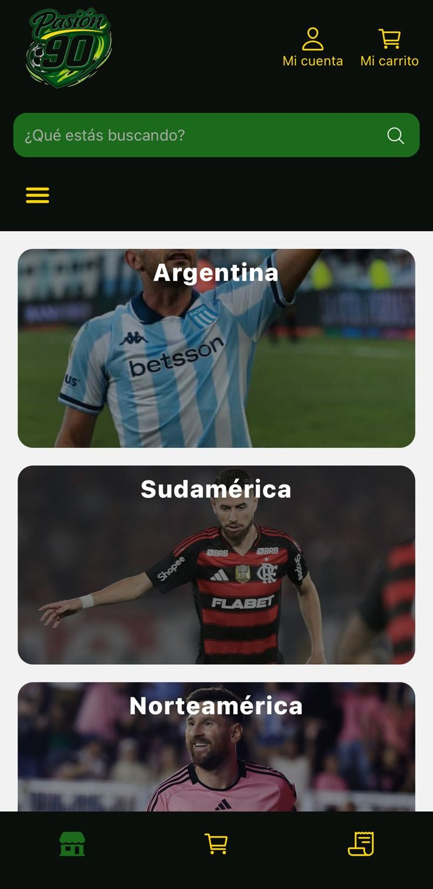
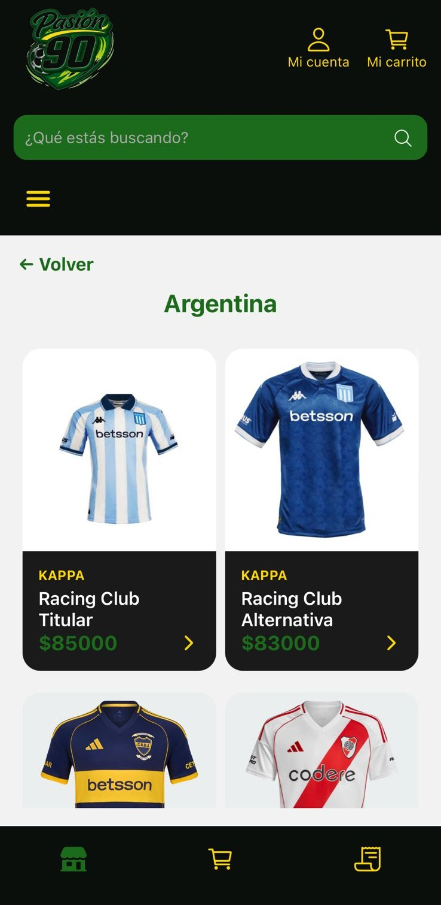
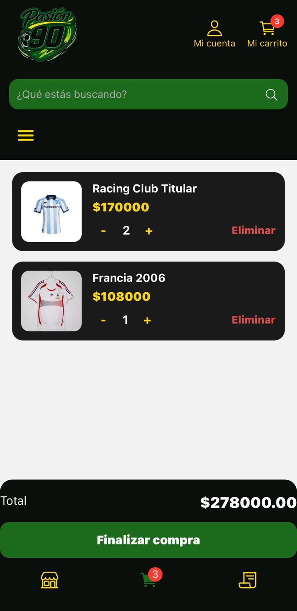

# ⚽ Pasion 90 - Ecommerce de Camisetas de Fútbol


Proyecto desarrollado para el curso **Desarrollo de Aplicaciones** de Coderhouse.

---

## 📱 Descripción

Pasion 90 es una app de ecommerce de camisetas de fútbol donde los usuarios pueden:

- Explorar productos por categorías
- Registrarse e iniciar sesión
- Agregar productos al carrito
- Realizar órdenes de compra

---

## 📸 Capturas






---

## 🛠️ Tecnologías utilizadas

- React Native (Expo)
- React Navigation
- Redux Toolkit (RTK)
- Firebase (Realtime Database y Autenticación)
- Librerías auxiliares de Expo (expo-image, expo-font, etc.)

---

## 🧩 Arquitectura

La aplicación utiliza Redux Toolkit para el manejo de estado global, organizando la lógica en slices.

La navegación se gestiona con React Navigation mediante un stack principal y navegación por tabs.

Firebase se encarga de:
- Autenticación de usuarios
- Persistencia de datos en Realtime Database

---

## Requisitos previos

Antes de instalar y ejecutar la app, necesitás tener instalados:

- [Node.js](https://nodejs.org/) (versión 20 o superior recomendada)
- Expo CLI (global)
- [Git](https://git-scm.com/)
- Cuenta de Firebase con un proyecto configurado (necesario para autenticación y base de datos)

---

## Instalación y configuración

1. Cloná el repositorio:

    ```bash
	git clone https://github.com/FelipeGil05/Ecommerce-Camisetas.git
    cd Ecommerce-Camisetas
    ```

2. Instalá las dependencias:

	```bash
	npm install
	```

3. Configurá las variables de entorno para Firebase:

	Crea un archivo `.env` con tus credenciales de Firebase.
	```js
	EXPO_PUBLIC_FIREBASE_API_KEY=...
	EXPO_PUBLIC_FIREBASE_AUTH_URL=...
   	```
	Podés obtenerlas desde la consola de Firebase.

4. Iniciá la aplicación en modo desarrollo:

	```bash
	npx expo start
	```

5. Abrí la aplicación en un emulador o en un celular con Expo Go.

---

## 🔥 Configuración de Firebase

La aplicación utiliza Firebase para manejar autenticación y persistencia de datos.

### Authentication

Se utiliza Firebase Authentication para la gestión de usuarios (registro e inicio de sesión mediante email y contraseña).

### Realtime Database

La base de datos contiene las siguientes colecciones:

- /products
- /categories
- /orders